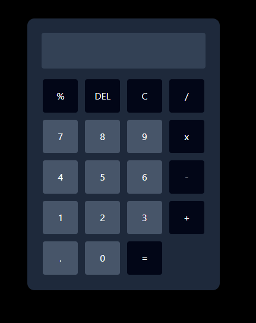

# 🧼 Calculadora React + TypeScript

Esta es una calculadora básica desarrollada con **React**, **TypeScript** y **Tailwind CSS**, que permite realizar operaciones matemáticas comunes. El objetivo principal fue practicar conceptos fundamentales de React, manejo de estado y pruebas automatizadas con **Jest + React Testing Library**.

---

## 🚀 Funcionalidades

* ✅ Suma, resta, multiplicación y división
* ✅ Manejo de punto decimal
* ✅ Borrar un número con `DEL`
* ✅ Borrar todo con `C`
* ✅ Cálculo de porcentaje (`%`)
* ✅ Manejo de errores como la división por cero

---

## 📁 Estructura del Proyecto

```
src/
├── components/
│   ├── Barra.tsx            # Componente de pantalla de resultados
│   ├── Boton.tsx            # Botones numéricos
│   └── BotonOperacion.tsx   # Botones de operaciones
├── utils/
│   └── operaciones.ts       # Lógica matemática de las operaciones
├── App.tsx                  # Componente principal
└── main.tsx                # Punto de entrada de React
```

---

## 🧠 Lógica Principal

* Se utiliza `useState` para manejar:

  * `ValueNumeric`: número actual en pantalla
  * `operador`: operador seleccionado (`+`, `-`, `x`, `/`, `%`)
  * `valorPrevio`: número anterior guardado antes de seleccionar una operación

* Al presionar un número, se concatena a `ValueNumeric`.

* Al presionar una operación:

  * Se guarda el número actual en `valorPrevio`
  * Se guarda el operador seleccionado
  * Se reinicia `ValueNumeric` para escribir el segundo número

* Al presionar `=`, se llama a la función `operar()` con los tres datos (`a`, `operador`, `b`).

---

## 🧪 Pruebas Unitarias

Se incluyeron pruebas automatizadas para validar que la calculadora funciona correctamente:

```bash
npm run test
```

Pruebas realizadas:

* ✅ Realizar una suma
* ✅ Realizar una multiplicación
* ✅ Manejo de punto decimal
* ✅ Eliminar el último número con `DEL`
* ✅ Eliminar todo con `C`
* ✅ División por cero muestra `"Error"`
* ✅ Porcentaje calcula correctamente

---

## 💅 Estilos

La interfaz fue construida con **Tailwind CSS**, utilizando un diseño de cuadrícula de 4 columnas para los botones y estilos oscuros para la calculadora.

---

## 🛠️ Instalación y ejecución

1. Clona el repositorio:

```bash
git clone https://github.com/Migfive/Calculadora-TS.git 
cd calculadora-TS
```

2. Instala dependencias:

```bash
npm install
```

3. Ejecuta la app:

```bash
npm run dev
```

---

## 🤖 Tecnologías Utilizadas

* React + TypeScript
* Tailwind CSS
* Jest + React Testing Library
* Vite (para el entorno de desarrollo)

---

## 📸 Capturas



---

## 🧑‍💻 Autor

Desarrollado por **Miguel** como parte de su proceso de aprendizaje en desarrollo web y JavaScript.

---

## 📋 Licencia

Este proyecto es de uso libre para fines educativos.
